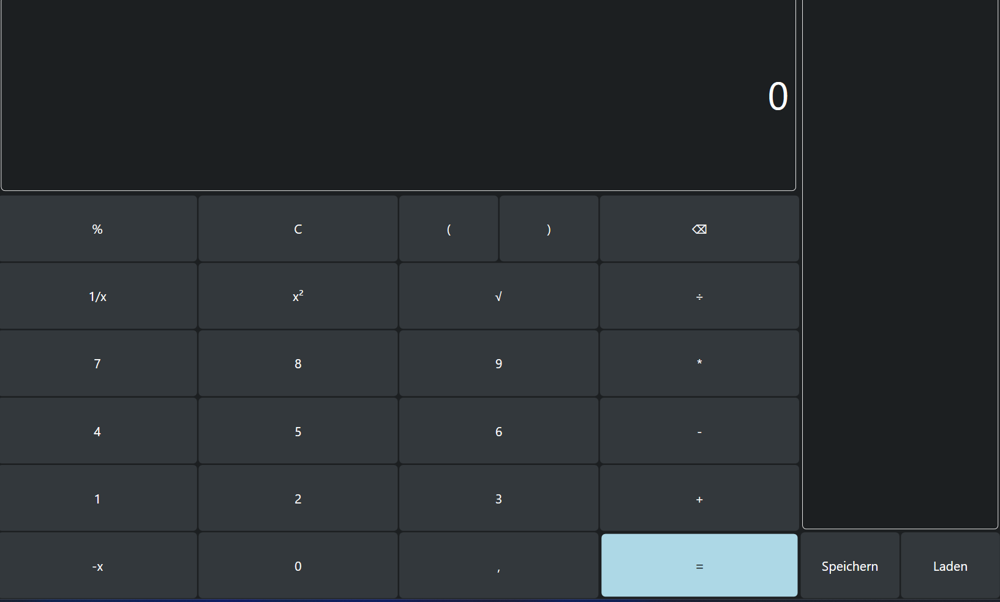
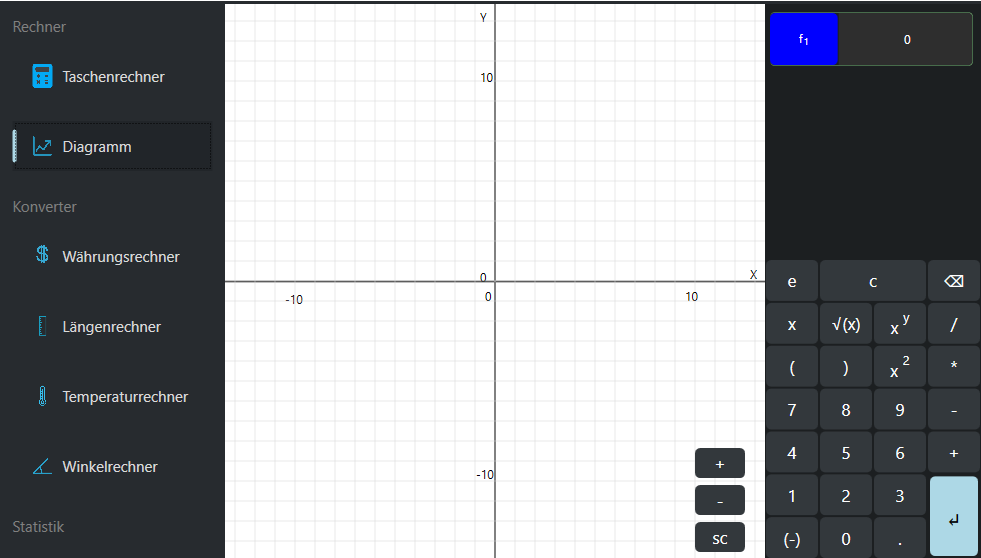
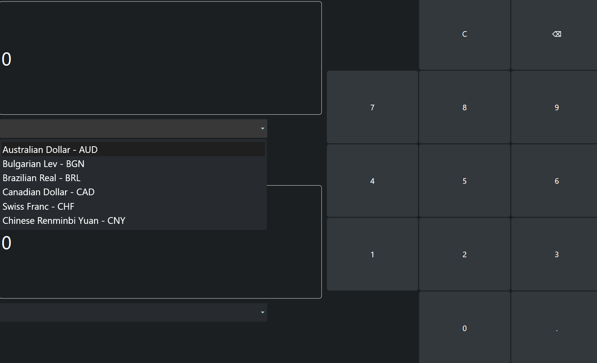
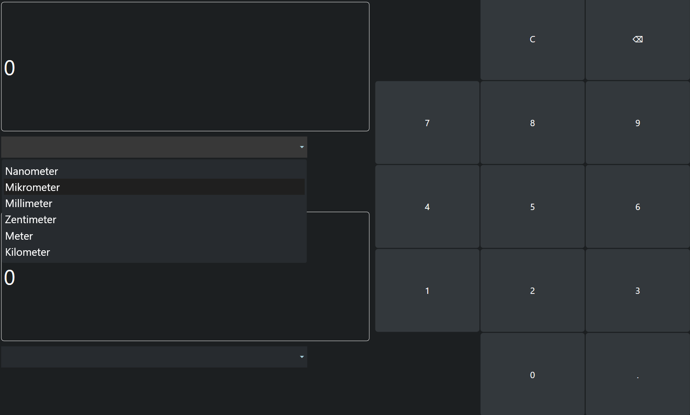
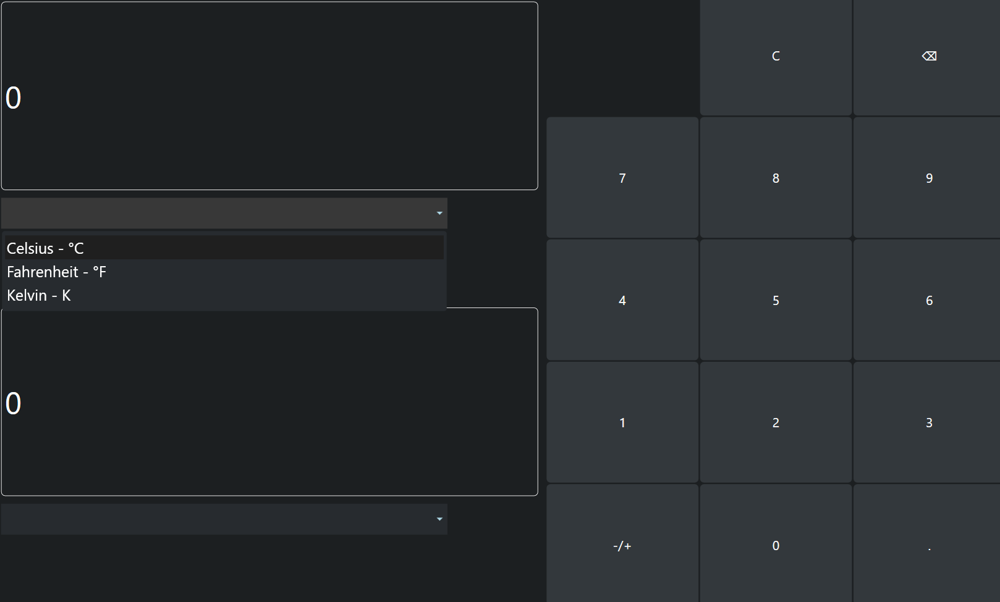
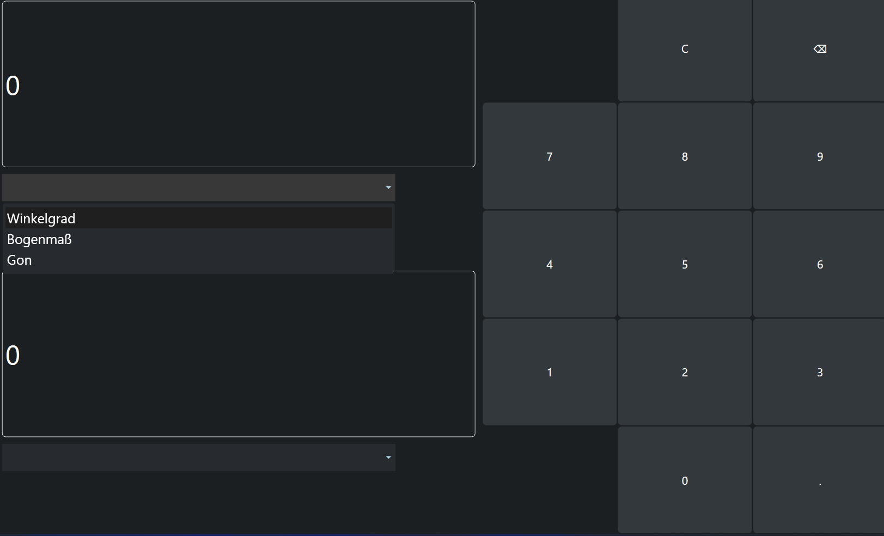
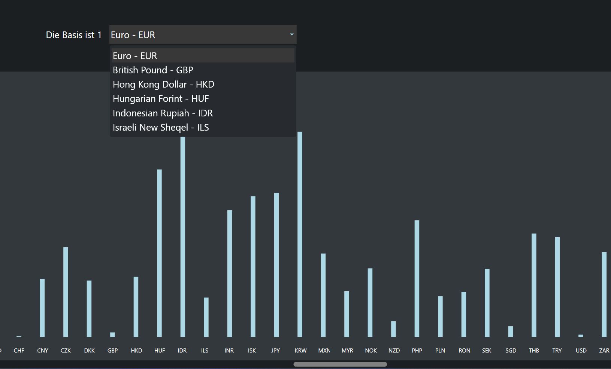
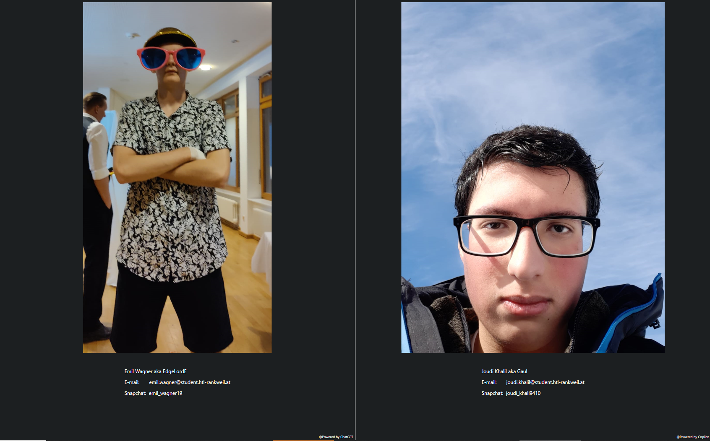

# Planungsphase

# Multi Taschenrechner

## Erstes Klassendiagramm und Grund Vorstellung

## Must haves
- Normaler Taschenrechner (+, -, /, *, 2.Wurzel, hoch2, clear)
- Menüleiste
- Rechnung&Ergebniss Speichern/Laden
- Umrechner von Währungen
- Graphen Zeichner
- Logging
## Nice to haves
- Umrechnungen (z.B. Länge, Winkel, Temperaturen)
- Diagramm über den grafischen Unterschied von Währungen
- Graph als png herunterladen
- Web API Anbindung
- Verwendung von externer Bibliothek (NuGet Package Ncalc)

## Wie soll die Umsetzung sein?
### Milestones
1. Klassendiagramme, Planungsphase fertig
2. normaler Taschenrechner anfangen; Graphen Zeichner anfangen
3. Graphen Zeichner weiter machen; Serialisierung bei normaler Taschenrechner
4. Graphen Zeichner und normaler Taschenrechner fertig; Währungsrechner und Design anfangen
5. Währungsrechner fertig; Diagramm anfangen
6. Diagramm fertig; Längen-, Winkel-, und Temperaturenrechner anfangen
7. Mit den Rechnern fertig und Design fertigstellen
8. Dokumentation feinschliff

### Wer macht was?
Emil: Fokus: Front End (z.B. Menüleiste) und Geogebra Fake (Back und front end)
Joudi: Fokus: Back End (z.B. der normale Taschenrechner) und auch Front End ein bisschen

## Wie wurde die Software getestet?
Sie wurde durch Visual Studio von Microsoft getestet.

## Welche Softwarevoraussetzungen werden benötigt.
Die neueste Version von Visual Studio mit ".Net6.0".

## Bedienungsanleitung
### Menüleiste

Hier können Sie zwischen den anderen Modi immer wechseln. In den Einstellungen sehen Sie noch ein paar Informationen über die Ersteller des Programms.

### Normaler Taschenrechner

Hier können Sie Rechnung berechnen lassen, indem man mithilfe des Zahlengitters unten Zahlen oder Zeichen eingibt oder Rechenverfahren ausführen. Wenn man einen Rechenfehler macht dann kommt als Lösung "undefined" raus. Rechts wird dann ein Verlauf Ihrer Rechnungen angezeigt. Wenn Sie auf eine Rechnung klicken wird es in das Eingabefeld überschrieben. Zuletzt gibt es unter dem Verlauf noch 2 Buttons mit denen man den Verlauf speichern oder von wo anders laden kann.

### Diagramm

Hier kann man auf der rechten Seite eine Funktion eingeben und sie wird dann auf dem Koordinatensystem gezeichnet. Mann kann bis zu 10 Graphen zeichnen. Bevor man einen neuen Graphen machen will muss man zuerst den davor bearbeiten. Wenn man auf den Button z.B. "f1" klickt bei dem Graph kann man diesen dann bearbeiten und die Umrundung wird grün, sodass man sieht welchen Graph Sie gerade bearbeiten. Drücken Sie bitte immer Enter wenn sie etwas geändert haben, um zu bestätigen das sie es wirklich wollen.

### Währungsrechner

Hier können Sie eine Währung auswählen, indem man die Leiste unter der ersten 0 klickt und es erscheint eine Liste mit vielerlei Währungen die man auswählen kann, dies klappt auch mit der unteren Leiste. Jedoch können Sie nur dann die Zahleneingabe mithilfe des Gitters rechts machen, wenn Sie Ihre Basis Währung und die Ziel Währung auswählen.

### Längenrechner

Hier ist es gleich wie beim Währungsrechner, bloß sind es hier Längen anstatt Währungen. Für die Zahlen Eingabe müssen Sie auch wieder zuerst beide Längen auswählen.

### Temperaturrechner

Hier ist es gleich wie beim Währungsrechner, bloß sind es hier Temperaturen anstatt Währungen und es gibt nun einen Knopf damit Sie Ihre Eingabe negieren können. Für die Zahlen Eingabe müssen Sie auch wieder zuerst beide Temperaturen auswählen.

### Winkelrechner

Hier ist es gleich wie beim Währungsrechner, bloß sind es hier Winkel Einheiten anstatt Währungen. Für die Zahlen Eingabe müssen Sie auch wieder zuerst beide Winkel Einheiten auswählen.

### Währungsvergleich

Hier handelt es sich um eine Statistik, die grafisch angibt wie sehr sich die anderen Währungen von der oben ausgewählten Währung unterscheiden. Zu Ihrer Information: Die grafischen Werte hier sind nicht genau da sie logarithmisch skaliert sind. Und je größer der Balken unten ist, desto mehr Wert hat die ausgewählte Währung zu der Währung mit dem Balken.

### Hilfe

Hier sehen sie unser Team und deren Kontaktdaten, die hart an diesem Projekt geschuftet haben.

