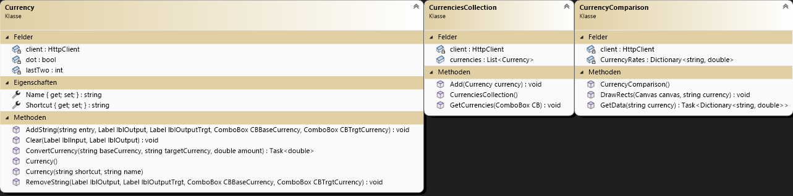

# Planungsphase

# Multi Taschenrechner

## Erstes Klassendiagramm und Grund Vorstellung

## Must haves
- Normaler Taschenrechner (+, -, /, *, 2.Wurzel, hoch2, clear)
- Menüleiste
- Rechnung&Ergebniss Speichern/Laden
- Umrechner von Währungen
- Graphen Zeichner
- Logging
## Nice to haves
- Umrechnungen (z.B. Länge, Winkel, Temperaturen)
- Diagramm über den grafischen Unterschied von Währungen
- Graph als png herunterladen
- Web API Anbindung
- Verwendung von externer Bibliothek (NuGet Package Ncalc)

## Wie soll die Umsetzung sein?
### Milestones
1. Klassendiagramme, Planungsphase fertig
2. normaler Taschenrechner anfangen; Graphen Zeichner anfangen
3. Graphen Zeichner weiter machen; Serialisierung bei normaler Taschenrechner
4. Graphen Zeichner und normaler Taschenrechner fertig; Währungsrechner und Design anfangen
5. Währungsrechner fertig; Diagramm anfangen
6. Diagramm fertig; Längen-, Winkel-, und Temperaturenrechner anfangen
7. Mit den Rechnern fertig und Design fertigstellen
8. Dokumentation feinschliff

### Wer macht was?
Emil: Fokus: Front End (z.B. Menüleiste) und Geogebra Fake (Back und front end)
Joudi: Fokus: Back End (z.B. der normale Taschenrechner) und auch Front End ein bisschen

## Wie wurde die Software getestet?
Sie wurde durch Visual Studio von Microsoft getestet.

## Welche Softwarevoraussetzungen werden benötigt.
Die neueste Version von Visual Studio mit ".Net6.0".

## Funktionsblöcke bzw. Architektur

## Bedienungsanleitung
### Menüleiste

Hier können Sie zwischen den anderen Modi immer wechseln. In den Einstellungen sehen Sie noch ein paar Informationen über die Ersteller des Programms.

### Normaler Taschenrechner

Hier können Sie Rechnung berechnen lassen, indem man mithilfe des Zahlengitters unten Zahlen oder Zeichen eingibt oder Rechenverfahren ausführen. Wenn man einen Rechenfehler macht dann kommt als Lösung "undefined" raus. Rechts wird dann ein Verlauf Ihrer Rechnungen angezeigt. Wenn Sie auf eine Rechnung klicken wird es in das Eingabefeld überschrieben. Zuletzt gibt es unter dem Verlauf noch 2 Buttons mit denen man den Verlauf speichern oder von wo anders laden kann.

### Diagramm

Hier kann man auf der rechten Seite eine Funktion eingeben und sie wird dann auf dem Koordinatensystem gezeichnet. Mann kann bis zu 10 Graphen zeichnen. Bevor man einen neuen Graphen machen will muss man zuerst den davor bearbeiten. Wenn man auf den Button z.B. "f1" klickt bei dem Graph kann man diesen dann bearbeiten und die Umrundung wird grün, sodass man sieht welchen Graph Sie gerade bearbeiten. Drücken Sie bitte immer Enter wenn sie etwas geändert haben, um zu bestätigen das sie es wirklich wollen.

### Währungsrechner

Hier können Sie eine Währung auswählen, indem man die Leiste unter der ersten 0 klickt und es erscheint eine Liste mit vielerlei Währungen die man auswählen kann, dies klappt auch mit der unteren Leiste. Jedoch können Sie nur dann die Zahleneingabe mithilfe des Gitters rechts machen, wenn Sie Ihre Basis Währung und die Ziel Währung auswählen.

### Längenrechner

Hier ist es gleich wie beim Währungsrechner, bloß sind es hier Längen anstatt Währungen. Für die Zahlen Eingabe müssen Sie auch wieder zuerst beide Längen auswählen.

### Temperaturrechner

Hier ist es gleich wie beim Währungsrechner, bloß sind es hier Temperaturen anstatt Währungen und es gibt nun einen Knopf damit Sie Ihre Eingabe negieren können. Für die Zahlen Eingabe müssen Sie auch wieder zuerst beide Temperaturen auswählen.

### Winkelrechner

Hier ist es gleich wie beim Währungsrechner, bloß sind es hier Winkel Einheiten anstatt Währungen. Für die Zahlen Eingabe müssen Sie auch wieder zuerst beide Winkel Einheiten auswählen.

### Währungsvergleich

Hier handelt es sich um eine Statistik, die grafisch angibt wie sehr sich die anderen Währungen von der oben ausgewählten Währung unterscheiden. Zu Ihrer Information: Die grafischen Werte hier sind nicht genau da sie logarithmisch skaliert sind. Und je größer der Balken unten ist, desto mehr Wert hat die ausgewählte Währung zu der Währung mit dem Balken.

### Hilfe

Hier sehen sie unser Team und deren Kontaktdaten, die hart an diesem Projekt geschuftet haben.

## Quellen Bilder

https://www.flaticon.com/de/kostenloses-icon

# Projekttagebuch

## Joudi

### Dokumentation
| Tag    | Was gemacht?                                                                                                          |
| ------ | --------------------------------------------------------------------------------------------------------------------- |
| 24.04. | Planung                                                                                                               |
| 01.05. | Normaler Taschenrechner Basis Design gemacht                                                                          |
| 08.05. | Normaler Taschenrechner hälfte fertig, Paket "ncalc" installiert; an Doku gearbeitet                                  |
| 15.05. | Prozent, negieren, Hoch 2, Wurzel, 1 Durch x fertig; Komma fertig angepasst; Klammern Funktionalität geändert         |
| 22.05. | Normaler Taschenrechner fertig; Logging fehlt noch                                                                    |
| 24.05. | Logging Pakete installiert; Normaler Taschenrechner nötige Logs gemacht; offiziell fertig mit Normaler Taschenrechner |
| 26.05. | Neues UserControl Fenster hinzugefügt für den Währungrechner bzw. Währungsrechner angefangen; Basis Design fertig     |
| 29.05. | Währungsrechner fast fertig                                                                                           |
| 04.06. | Währungsrechner fertiggestellt Logging fehlt                                                                          |
| 05.06. | Währungsvergleich angefangen und 3/4 fertig richtige Balken vom Diagramm fehlen                                       |
| 06.06. | Dezimalstelle Bug behoben bei Währungsrechner und Funktionalitäten verbessert; Währungsvergleich fertig fehlt Logging |
| 08.06. | Logging bei Währungsrechner, Währungsvergleich, und Taschenrechner gemacht; Taschenrechner Bugs behandelt             |
| 09.06. | Temperaturrechner fertiggestellt mit Logging                                                                          |

### Probleme
| Problem                                                                    | Lösung                                                                                                                                                                                        |
| -------------------------------------------------------------------------- | --------------------------------------------------------------------------------------------------------------------------------------------------------------------------------------------- |
| Die Logik hinter der Einabe der einzelnen Zahlen und Zeichen               | 5h lang dran geblieben um es zu lösen.                                                                                                                                                        |
| Problem mit dem Dezimaltrennzeichen, dass es "." ignoriert                 | Herausgefunden das es Kulturabhängig ist und man muss es mit einer Zeile Code ändern, dass "." als Dezimaltrennzeichen verwendet wird                                                         |
| API Wahl, weil viele APIs Zahlungsbedingt sind und vielleicht betrügerisch | Herr Diem um Hilfe gebittet und dank Herr Diem eine gefunden                                                                                                                                  |
| Beim Währungsvergleich: Die Höhe der Balken im Diagramm => waren zu klein  | Herausgefunden das man mit logarithmischem Skalieren die kleinen Werte vergrößern kann und die großen Werte komprimieren kann (Habe es in Mathe gelernt, aber ist mir recht Spät aufgefallen) |

## Emil

### Dokumentation
| Tag  | Was gemacht?                                                                                                                  |
| ---- | ----------------------------------------------------------------------------------------------------------------------------- |
| 24.4 | PLanung                                                                                                                       |
| 29.4 | Menü mit einem Tutorial angefangen                                                                                            |
| 30.4 | Menü hat nicht geklappt wie es sollte also neu angefangen; Menü fast fertiggestellt (ohne Bilder)                             |
| 1.5  | Menü nochmals überarbeitet und noch den Style des Menüs verschönert; Dem normalen Taschenrechner einen schönen Style verpasst |
| 3.5  | Alle Pflichtorder erstellt und die Programme usw. verschoben; Bilder für das Menü eingefügt; Im Menü die Bilder hinzugefügt   |
| 8.5  | Bei dem Menü noch mehr Bilder hinzugefügt                                                                                     |
| 9.5  | Die Tastatur bei dem Fake Geogebra fertig gemacht mit Style                                                                   |
| 15.5 | Der Einstellungsbutton nach unten verschoben; Das Koordinatensystem erstellt wo man rein und raus zoomen kann;                |
| 22.5 | Man kann jetzt Graphen zeichnen und rechts max 10 Graphen eingeben (noch nicht alle eingaben behandelt)                       |
| 29.5 | Graph kan eingegeben werden und wird dann gezeichnet (man kann noch nicht alles eingeben)                                     |
| 4.6  | Man kann bei dem Graph hoch und Wurzel zahlen eingeben und diese werden auch gezeichnet                                       |
| 5.6  | Man kann jetzt bei dem Graphen alles eingeben und es funktioniert soweit (noch keine Fehler prüfung), Design von dem Währungsumrechner gemacht (hauptsächlich für die comboBox) |
| 6.6  | Menü mit Überschrieften versehen sodass alles schön für den Nutzer gegliedert ist, Design für das Diagramm fertig gemacht, Längenumrechner gemacht, Screenshot für das Diagramm gemacht|
| 7.6  | Bilder in das Menü hinzugefügt und dann in Gimp so geändert das die bilder Blau anstatt Schwarz sind, Bei dem Diagramm so gestylt, dass das ausgewählte Element grün umrandet wird. |
| 8.6  | UserControlSettings fertig gemacht und geloggt, Winkelumrechenr gemacht, Alle meine Dateien die ich bis jetzt gecodet habe geloggt|
| 8.6 (Nacht)/9.6 | Winkelumrechner gemacht und alles dokumentiert |
| 9.6 | Winkelumrechner geloggt und bei dem MainWindow ein ScroolViewer hinzugefügt |

## Probleme
| Problem | Lösung |
| ---- | ----------------------------------------------------------------------------------------------------------------------------- |
| Wie wandle ich einen Hochzahl string in eine Rechnung um | Ich ersetzte die Hochzahl durch Math.Pow() |
| Wie rechne ich jetzt einen string "Math.Pow" | Geht nicht ich nehme Ncalc.Pow |
| Wie rechne ich Wurzel aus wenn es keine Wurzel Funktion bei Ncalc gibt | Ich mache es mit der Hcohzahl, weil jede Wurzel kann man auch in eine Hochzahl umwandeln|
| Wie mache ich ein schwarzes Logo zu einem Blauen | Ich mache in Gimp der Farbvertausch |
| Wie macht man in Gimp das die Bilder nicht nur Graustufen haben oder nur die Farbe Weiß und Schwarz | Man geht im Menü auf Bild und dann Modus und dann RGB |

